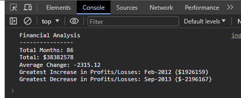

# Console-Finances

Console-Finances: creating code for analyzing the financial records of a company.

## How have i done this?

- I have calculated the total number of months using the array.length, this returns the length which is the totalNumberOfMonths, I have stored this as a const variable because it never changes from the data set we were given.
- Create my initial variables, I used let because they're a better practice for the greatestIncrease and greatestDecrease we have initilaised two properties, the month and the amount are set to an empty string and 0. We update this inside the for loop
- I used a for loop to go through the finances array we have been given within the for loop we do the following:
  - get the month and the amount from the finance entry of the array
  - add the amount value to the total running profits or losses
  - I skipped the first entry of finances as there is nothing to compare
  - i have calculated the change from the previous month
  - i have added the change to the total
  - getting the change is the biggest increase so far and update it
  - getting the change is the biggest decrease so far and update it
- here i have calculated the average change, theres only 85 changes we subtract 1 from this total

### How to use

1. Run the html.index file
2. go to the console and you should see the image below:

